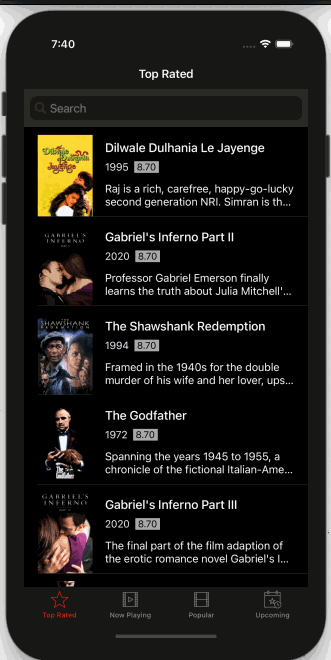
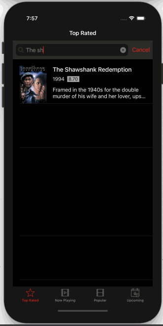

# Moovflix - The TMDB Api
An iOS app that gets movie information from the TMDB api

## How to Use 

**Step 1:**

Download or clone this repo by using the link below:

```
https://github.com/binemugha/Moovflix.git
```

**Step 2:**

Go to projects root and execute the following command in console to get the required dependencies: 

```
pod install 
```

**Step 3:**

Change the Swift language version in the pod project for Alamofire and Alamofire Image to Swift 4 and run the project

##  App features
- User can view a list of movies. List of top rated movies. For extras, added list of popular, now playing and upcoming movies. Poster images load asynchronously.
- User can view movie details by tapping on a movie in the list.
- User can pull to refresh the movie list.
- User can search movies.
- Placeholder image when images load from Network.
- Movie details page contain backdrop image, overview, similar movies, duration, year of the movie and other relevant information.
- All images are cached in memory and disk.
- User can view trailer of a particular movie in the youtube app or a web browser.
- Endless scrolling.
- User sees an error message when there is a network error.

## Up-coming features
- Add a firebase backend for users to have profile and favourite lists.


## Walkthrough






## Helpers
GIF created with [LiceCap](http://www.cockos.com/licecap/).
Icons are from [Icons8](https://icons8.com).

